# Zania | AI Challenge


This project provides a Retrieval-Augmented Generation (RAG) solution for efficiently querying the given documents. The solution includes PDF prcocessing, vector storage setup, and an advanced query-answering API built with FastAPI. The project is optimized to deliver relevant answers, using techniques like vector similarity search, query augmentation, and content re-ranking.

## Project Overview

### 1. Web Crawling
The project starts with PDF processing to extract text in markdown format. This stage involves:

- **Script**: `process_doc.py`
- **Process**:
  - Process the pdf using **pymupdf4llm**.
  - This parses the PDF in markdown format.
  - Converted markdown text into **Parent-child structure** based on consecutive Hash (`#`) tags:
    - `parent (#)`
    - `child (##)`
    - `grand_child (###)`
    - `great_grand_child (####)`

### 2. Vector Database Setup
The next stage is to process the **Parent-child structure** to create a vector database for efficient retrieval.

- **Database**: ChromaDB
- **Processing**: `vector_db_setup.py`
  - Converts **Parent-child structure** into LangChain documents, with added metadata.
  - Metadata includes section `index` (based on headers marked with `#`), `start_page`, `end_page` and `id`.

### 3. RAG Execution
The next stage is to perform an advanced search with combined vector search, keyword search, and re-ranking with query augmentation.

- **Script**: `rag.py`
- **Processing**:
  - Uses GPT-4o-mini for domain-aware query augmentation, generating alternative queries based on document indexes.
  - Retrieve & Select the top `8` documents from each of the two queries (one original and one augmented).
  - Re-rank these `16` documents with updated scores based on id if applicable, to select top `8` documents.
  - Passes the top `8` documents to GPT-4o-mini to generate the final response with answers. 


### 4. API Setup
The final stage provides an API endpoint using FastAPI.

- **Script**: `main.py`
- **Functionality**:
  - Takes a List of queries from the user and returns an answer in JSON format

### Example API Response
The RAG system responds in the following format:

```json
{"What is the name of the company?": "The name of the company is Zania, Inc.",
"Who is the CEO of the company?": "The CEO of the company is Shruti Gupta."}
```



## Getting Started

### Prerequisites
- Python 3.10.x
- `requirements.txt` contains all necessary libraries (install with `pip install -r requirements.txt`).
- API keys for OpenAI and Cohere (add these keys to your environment).

### Running the API

1. **Install Requirements**:
   ```bash
   pip install -r requirements.txt
   ```

2. **Set Environment Variables**:
   ```bash
   export OPENAI_API_KEY="your_openai_key"
   export COHERE_API_KEY="your_cohere_key"
   ```

3. **Start the FastAPI Server**:
   ```bash
   uvicorn main:app --reload
   ```

4. **Access the API Documentation**:
   Visit [http://127.0.0.1:8000/docs](http://127.0.0.1:8000/docs) for Swagger documentation.

### Making API Requests

You can use `curl` to test the endpoint:

```bash
curl -X 'POST' \
  'http://127.0.0.1:8000/get_answer?questions=%5B%22What%20is%20the%20name%20of%20the%20company%3F%22%2C%20%22Who%20is%20the%20CEO%20of%20the%20company%3F%22%2C%20%22What%20is%20their%20vacation%20policy%3F%22%2C%20%22What%20is%20the%20termination%20policy%3F%22%5D' \
  -H 'accept: application/json' \
  -H 'Content-Type: multipart/form-data' \
  -F 'pdf_file=@handbook.pdf;type=application/pdf'
```


## Why This Approach?

1. **Hybrid Search (Vector + Keyword Search)**:
   - A hybrid approach was selected to leverage semantic relevance (via vector search) and exact term matching (via keyword search).

2. **Query Augmentation**:
   - Upon analysis, it was evident that many user queries were incomplete or ambiguous. I used GPT-4o-mini to generate alternative queries to supplement the initial query, hoping to cover more nuanced domain-specific terms.
   - Although query augmentation did help, it did not significantly improve document ranking alone.

3. **Incorporating Domain-Specific Knowledge**:
   Through further testing, it became clear that domain-specific terminology was impacting retrieval effectiveness. To address this, I added document indexes to generate alternative queries tailored to the domain.
   - This strategy reduced the appearance of desired documents to the top 5.

4. **Generating the Final Response**:
   - With the updated pipeline, the top 8 documents are passed to GPT-4o-mini for response generation to get the answer


## Future Improvements

1. **Enhanced Summarization**:
   - To handle more documents within the RAG pipeline, I plan to add enhanced summaries that distil essential information, improving document relevance and response generation.

2. **Domain-Specific Query Augmentation**:
   - Further analysis of query-specific patterns could enhance the query augmentation step, producing more precise alternative queries for each user query.

3. **Expanded Document Filtering**:
   - Instead of limiting to the top 15 documents, using summarization as an additional filtering mechanism can increase response accuracy, helping the LLM to generate higher-quality answers.

4. **Semantic Routing for Optimized Document Selection**:
   - Pre-processing documents to classify them based on themes (e.g., setup, troubleshooting, A2P campaigns) and classifying user queries dynamically can act as an additional filter in the RAG pipeline, narrowing down documents to contextually relevant ones.
     
5. **Enriching Documents with Vision Capabilities**:
   - Implementing methods like **[ColPali](https://huggingface.co/blog/manu/colpali)**, **video transcript extraction**, and **image embedding** can add visual understanding to the pipeline. Since many support articles contain images and videos, incorporating these vision-based elements will provide a richer, multi-modal document representation, significantly boosting retrieval performance and ensuring more accurate responses for visually-dependent support content.

6. **Parallelized Advanced RAG**:
   - The current advanced RAG process, which combines hybrid retrieval with re-ranking for each augmented query, can be sped up by implementing **parallelization**. Running this in parallel for queries rather than sequentially could lead to a **2x to 3x speed improvement**, greatly enhancing response times. 
